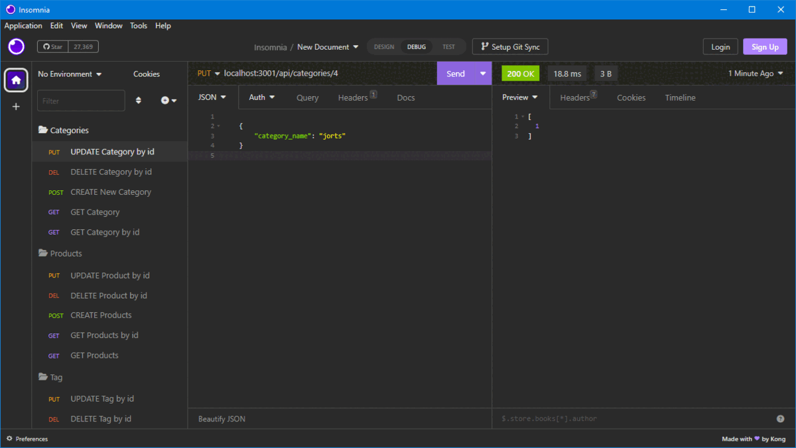
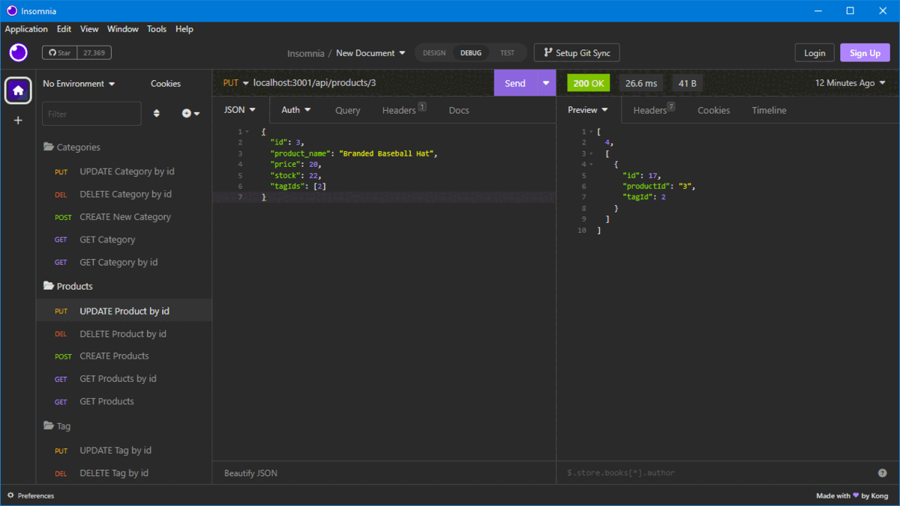
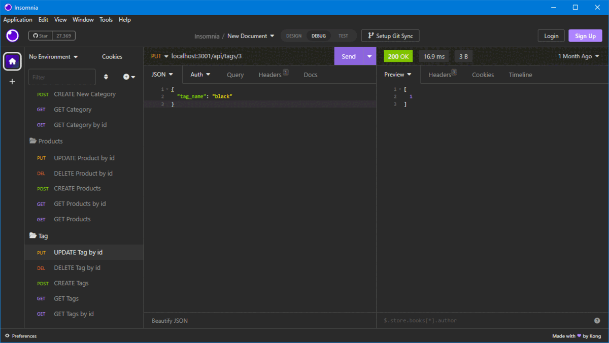

# E-Commerce-DataBase

## About

This is a Back-End Only Application for Use as an `E-Commerce-Database` 

## Table of Contents

- [E-Commerce-DataBase](#e-commerce-database)
  - [About](#about)
  - [Table of Contents](#table-of-contents)
  - [Description](#description)
  - [Preview](#preview)
    - [Category Routes:](#category-routes)
    - [User Product Routes:](#user-product-routes)
    - [Tag Routes:](#tag-routes)
  - [Installation](#installation)
  - [Walkthrough Video](#walkthrough-video)
  - [Tests](#tests)
  - [License](#license)

## Description

This `E-Commerce-Database` is a backend application that would empower a company or storefront to create products and add Categories and tags to said product for helping search for or recommend similar products to a customer. It uses `MySQL` as its database and the Node Module `sequelize` as its middleman for helping the server thats utilizing `Express.js` run through `Node.js` to communicate back and forth with `MySQL`. This application was developed to learn `MySQL` and `sequelize` to facilitate getting comfortable with SQL style Databases. This Application is a good starting point to flesh out into a full store app.

## Preview

The following Gifs Show the Api Routes of the Application and their functionality:

### Category Routes:

### User Product Routes:

### Tag Routes:

          
  
## Installation

The Application is Not Deployed although you are able to install it locally and mess with the endpoints yourself.

1. To get Started you will need [MySQL](https://www.mongodb.com/) installed as it is the SQL database we are using.
2. Clone The Repo Down
3. Create the Database ` ecommerce_db ` in your MySQL shell or MySQL Workbench application
4. Run ` npm i ` in your terminal once you cd into the root folder of the application
   1. Make sure after initializing you have the modules `sequelize`, `mysql2`, `express`, and `dotenv` installed in your node_modules folder
5. Optionally run ` node seeds/index ` if you'd like to use the included seeded data for testing, if not skip to step 6
6. Finally run ` node server ` and the server will be up and booted have fun testing

## Walkthrough Video

The Video Below Showcases Starting the Server and all of the Api routes:\
[Walk Through Video](https://drive.google.com/file/d/1nGzy-mocMmR6LVOT1wYUNwAgld1wDI2E/view?usp=share_link)

## Tests
  
  No Tests are currently written but using an application like [Insomnia](https://insomnia.rest/) your able to test the API routes and mess with the database on your own
  
## License

